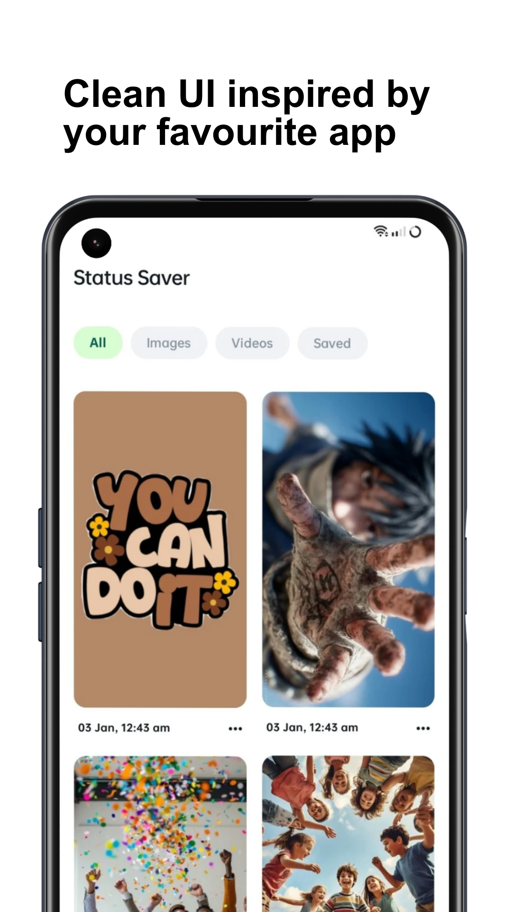
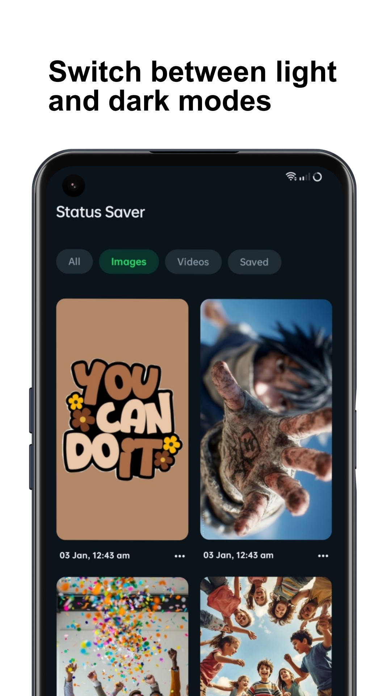
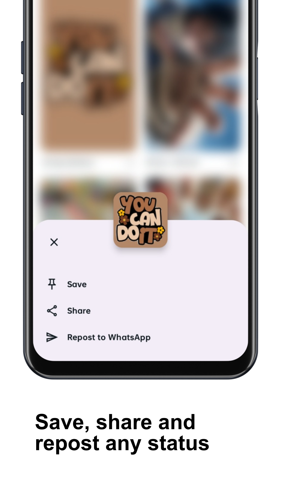
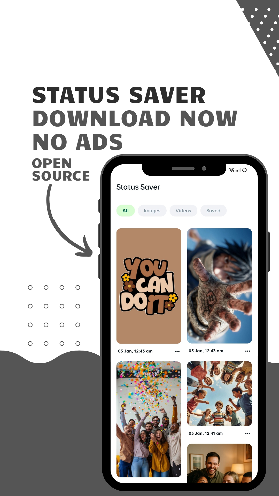

# WhatsApp Status Saver

An Android application for viewing, saving, and sharing WhatsApp status media files.

[](https://opensource.org/licenses/Apache-2.0)
[](https://kotlinlang.org/)
[](https://www.android.com/)

## Sponsors

If you find this project useful, please consider sponsoring: 

[](https://github.com/sponsors/vinithreddybanda)

## Overview

WhatsApp Status Saver allows users to access and manage WhatsApp status content stored locally on their Android devices. The application operates entirely offline without transmitting data to external servers.

## Features

- View all WhatsApp image and video statuses
- Save status files to device storage (Documents/StatusSaver)
- Share status content with other applications
- Repost statuses directly to WhatsApp
- Filter content by type (All, Images, Videos, Saved)
- Dark mode support
- Material Design 3 interface


## Screenshots

<p align="center">
  
  
  
  
</p>

## Technical Implementation

### Status Detection

The application scans multiple potential WhatsApp status directories: 

- `Android/media/com.whatsapp/WhatsApp/Media/. Statuses` (Android 11+)
- `WhatsApp/Media/.Statuses` (Android 10 and below)
- `Android/media/com.whatsapp.w4b/WhatsApp Business/Media/.Statuses`
- `WhatsApp Business/Media/.Statuses`

### File Processing

The app processes media files by:

- Filtering files by extension (`.jpg`, `.gif`, `.mp4`)
- Reading file metadata (last modified timestamp)
- Sorting by modification date (newest first)
- Generating video thumbnails using frame extraction
- Preventing duplicate entries using path-based deduplication

### Permissions

**Android 11 and above:**
- `MANAGE_EXTERNAL_STORAGE` - All Files Access permission

**Android 10 and below:**
- `READ_EXTERNAL_STORAGE` - Storage read permission

## Technology Stack

- **Language:** Kotlin (100%)
- **UI Framework:** Jetpack Compose
- **Concurrency:** Kotlin Coroutines and Dispatchers
- **Image Loading:** Coil with VideoFrameDecoder
- **Architecture:** MVVM pattern
- **Design System:** Material Design 3

## Project Structure

```
app/src/main/java/com/vinithreddybanda/whatsapstatus/
├── MainActivity.kt              # UI components and Compose screens
├── MainViewModel.kt             # State management and business logic
├── data/
│   └── StatusRepository.kt      # File system operations
└── model/
    └── Status.kt                # Data model
```

## Building the Project

```bash
git clone https://github.com/vinithreddybanda/WhatsapStatusSaver.git
cd WhatsapStatusSaver
./gradlew assembleDebug
```

## Installation

The APK can be built using Android Studio or Gradle command line tools.  The application requires Android API level as specified in the gradle configuration.

## Code Architecture

### Repository Layer
- Handles file system access and I/O operations
- Executes operations on IO dispatcher
- Manages status file discovery and caching
- Implements save/delete functionality

### ViewModel Layer
- Maintains UI state using Compose state management
- Provides derived states for filtered lists
- Coordinates background operations
- Manages tab selection and data refresh

### UI Layer
- Compose-based declarative UI
- Staggered grid layout for status display
- Bottom sheet for status actions
- Skeleton loading states
- Permission handling flows

## License

This project is licensed under the Apache License 2.0. See the [LICENSE](LICENSE) file for details.

```
Copyright 2026 VINITH REDDY BANDA

Licensed under the Apache License, Version 2.0 (the "License");
you may not use this file except in compliance with the License.
You may obtain a copy of the License at

    http://www.apache.org/licenses/LICENSE-2.0
```

## Disclaimer

This application is not affiliated with, endorsed by, or sponsored by WhatsApp LLC.  WhatsApp is a registered trademark of WhatsApp LLC.  The application requires appropriate permissions to access the WhatsApp status directory for functionality.

## Contributing

Issues and pull requests are welcome. Please ensure all contributions adhere to the existing code style and architecture patterns.

## Sponsorship

If you find this project valuable and would like to support its development, consider becoming a sponsor:

- [GitHub Sponsors](https://github.com/sponsors/vinithreddybanda)
- [Buy Me a KO-FI](https://ko-fi.com/dexandblue)

Your support helps maintain and improve this project. 

## Support

For bug reports and feature requests, please open an issue on the GitHub repository. 

## Acknowledgments

Special thanks to all contributors and sponsors who support this project. 
