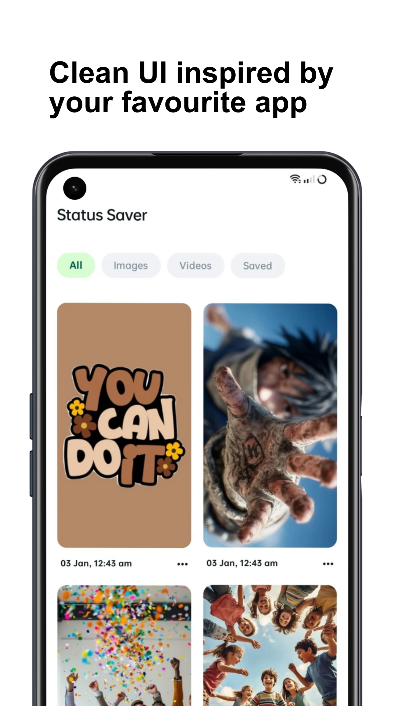
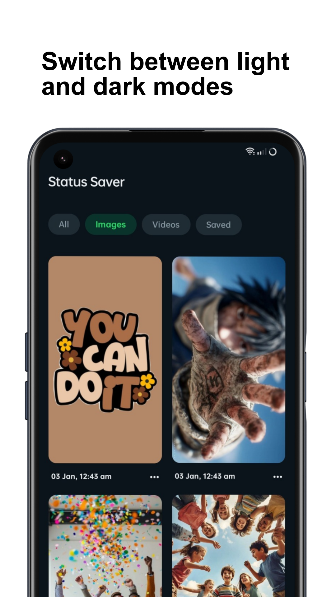
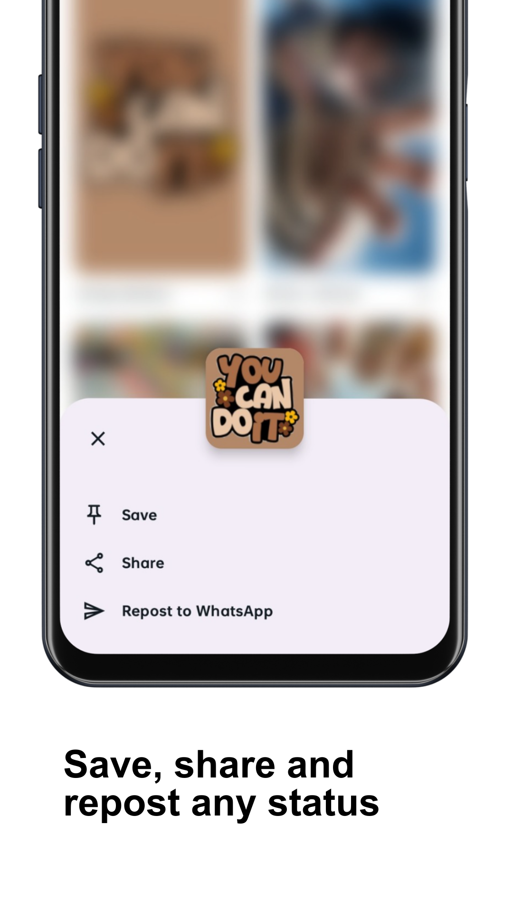
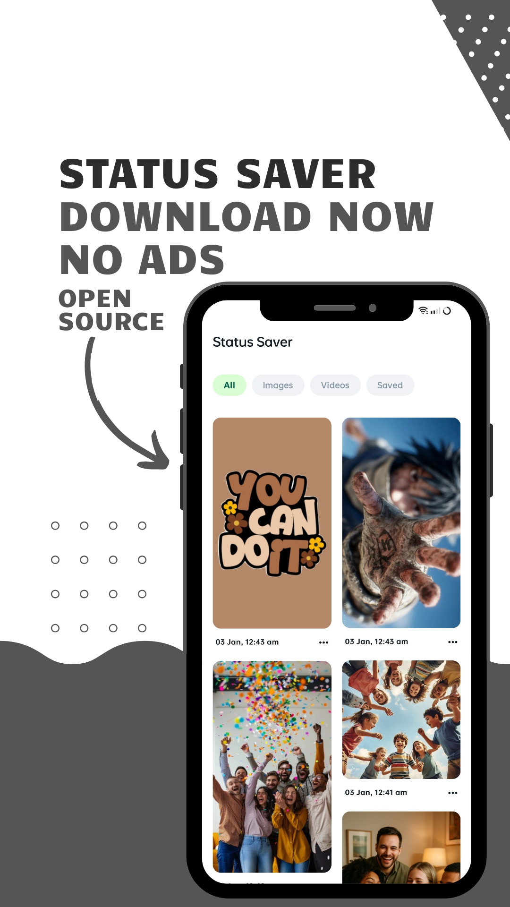

# WhatsApStatusSaver

[](https://opensource.org/licenses/Apache-2.0)
[](https://kotlinlang.org/)
[](https://www.android.com/)

An Android application for viewing, saving, and sharing WhatsApp status media files.

[](https://f-droid.org/packages/com.vinithreddybanda.whatsapstatus/)

## Overview

WhatsApp Status Saver allows users to access and manage WhatsApp status content stored locally on their Android devices. The application operates entirely offline without transmitting data to external servers.

## Screenshots

<p align="center">
  
  
  
  
</p>

### Permissions

**Android 11 and above:**
- `MANAGE_EXTERNAL_STORAGE` - All Files Access permission

**Android 10 and below:**
- `READ_EXTERNAL_STORAGE` - Storage read permission

## Technology Stack

- **Language:** Kotlin (100%)
- **UI Framework:** Jetpack Compose
- **Concurrency:** Kotlin Coroutines and Dispatchers
- **Image Loading:** Coil with VideoFrameDecoder
- **Architecture:** MVVM pattern
- **Design System:** Material Design 3

## Project Structure

```
app/src/main/java/com/vinithreddybanda/whatsapstatus/
├── MainActivity.kt              # UI components and Compose screens
├── MainViewModel.kt             # State management and business logic
├── data/
│   └── StatusRepository.kt      # File system operations
└── model/
    └── Status.kt                # Data model
```

## Building the Project

```bash
git clone https://github.com/vinithreddybanda/WhatsapStatusSaver.git
cd WhatsapStatusSaver
./gradlew assembleDebug
```

## Installation

The APK can be built using Android Studio or Gradle command line tools.  The application requires Android API level as specified in the gradle configuration.

## GitHub Actions APK Signing

The workflows below provide a production-grade automated pipeline:

- .github/workflows/build-apk.yml
  - Runs on pushes (except main) and pull requests.
  - Builds CI artifacts for validation.
- .github/workflows/release-on-main.yml
  - Runs automatically on every push to main.
  - Auto-calculates semantic version from commit messages.
  - Auto-creates git tag and GitHub Release.
  - Auto-attaches signed GitHub APK, F-Droid APK, and SHA256 files.

Distribution channels from a single main branch:

- GitHub flavor package: com.vinithreddybanda.whatsapstatus
- F-Droid flavor package: com.vinithreddybanda.whatsapstatus

Because package name is the same, users should stay on one distribution channel (GitHub or F-Droid). Android will block cross-channel updates when signer differs.

Security notes:

- The release keystore is never stored in the repository.
- The keystore is reconstructed only inside the CI runner and removed at the end of the job.
- Debug builds use a .dev applicationId suffix to avoid package conflicts with production installs.

Required GitHub Secrets for production release workflow:

- RELEASE_KEYSTORE_BASE64
- RELEASE_STORE_PASSWORD
- RELEASE_KEY_ALIAS
- RELEASE_KEY_PASSWORD

Version automation rules in release-on-main.yml:

- major bump when commit contains BREAKING CHANGE or !:
- minor bump when commit contains feat:
- patch bump for all other commits
- versionCode uses total git commit count to keep values monotonic

Local build examples:

- GitHub signed release (when signing env vars are set): ./gradlew assembleGithubRelease
- GitHub debug: ./gradlew assembleGithubDebug
- F-Droid release: ./gradlew assembleFdroidRelease

## F-Droid Metadata (GitLab)

F-Droid metadata is maintained in the F-Droid data repository (GitLab), not in this repository.
Use the template file fdroid-metadata.template.yml from this project when preparing your app entry for F-Droid.


## License

This project is licensed under the Apache License 2.0. See the [LICENSE](LICENSE) file for details.

```
Copyright 2026 VINITH REDDY BANDA

Licensed under the Apache License, Version 2.0 (the "License");
you may not use this file except in compliance with the License.
You may obtain a copy of the License at

    http://www.apache.org/licenses/LICENSE-2.0
```

## Disclaimer

This application is not affiliated with, endorsed by, or sponsored by WhatsApp LLC.  WhatsApp is a registered trademark of WhatsApp LLC.  The application requires appropriate permissions to access the WhatsApp status directory for functionality.

## Contributing

Issues and pull requests are welcome. Please ensure all contributions adhere to the existing code style and architecture patterns.

## Support

For bug reports and feature requests, please open an issue on the GitHub repository. 

## Acknowledgments

Special thanks to all contributors and sponsors who support this project. 
